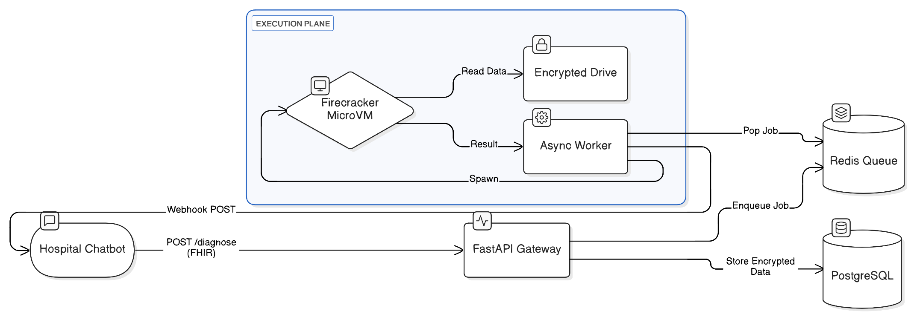

# 🏥 CliniSandbox: Secure Diagnostic ML Orchestrator

[](https://www.python.org/downloads/release/python-3110/)
[](https://fastapi.tiangolo.com)
[](https://opensource.org/licenses/MIT)
[](https://www.hhs.gov/hipaa/index.html)

**CliniSandbox** is a high-assurance infrastructure platform designed to execute "Black Box" medical diagnostic models in a secure, isolated environment. It acts as a middleware between Hospital Chatbots (HL7 FHIR Clients) and proprietary ML Inference Agents.

---

## 🏗 System Architecture

CliniSandbox uses an **Event-Driven Architecture** to decouple HTTP ingestion from heavy ML inference.



---

## 🚀 Key Features

### 1. 🧠 The "Negotiation Engine" (Semantic Validation)
Unlike standard APIs, CliniSandbox enforces **Strict Schema Validation** (Pydantic + FHIR). It acts as a semantic firewall, rejecting invalid clinical data before it wastes compute resources.
- Parses **HL7 FHIR R4** bundles.
- Compares patient data against the **Model Registry** requirements.
- **Result:** If a patient is missing specific Lab Tests (LOINC codes) required for a diagnosis, the API rejects the request and tells the Chatbot *exactly* what data to ask for.

### 2. 🛡️ HIPAA-Compliant Security
- **AES-256 Encryption at Rest:** Patient data (`fhir_bundle`) is transparently encrypted before being written to PostgreSQL using `Fernet` (AES-128-CBC + HMAC).
- **Zero-Trust Isolation:** Models run inside **AWS Firecracker MicroVMs** (KVM), ensuring malicious or buggy models cannot access the host network or other patients' data.

### 3. ⚡ High-Performance Async Core
- Built on **FastAPI** and **AsyncIO**.
- Uses **Redis** for reliable job queuing.
- Supports **Webhooks** with HMAC-SHA256 signatures for secure result delivery.

---

## 🛠 Technology Stack

- **Language:** Python 3.11 (Type Hinted)
- **API Framework:** FastAPI
- **Database:** PostgreSQL 15 (Async SQLAlchemy + Alembic)
- **Broker:** Redis 7
- **Virtualization:** AWS Firecracker (KVM)
- **Standard:** HL7 FHIR (via `fhir.resources`)

---

## ⚡ Quick Start (Local Dev)

The system includes a **Mock Virtualization Backend** so you can run it on Windows/Mac without KVM.

### 1. Prerequisites
- Docker & Docker Compose
- Python 3.11+ (optional, for local intellisense)

### 2. Launch the Stack
```bash
# Clone the repository
git clone https://github.com/yourusername/clinisandbox.git
cd clinisandbox

# Start Infrastructure (DB, Redis, API, Worker)
docker-compose up --build -d
```

### 3. Seed the Registry
The database starts empty. Inject a sample "Sepsis" model:
```bash
docker-compose exec db psql -U postgres -d clinisandbox -c "
INSERT INTO diagnostic_models (id, name, key, version, docker_image_path, accuracy, required_fhir_resources) 
VALUES ('a0eebc99-9c0b-4ef8-bb6d-6bb9bd380a11', 'Sepsis V1', 'sepsis', '1.0', 'mock/sepsis', 0.98, 
'{\"required_observations\": [{\"code\": \"8310-5\", \"display\": \"Body Temp\", \"mandatory\": true}]}');"
```

### 4. Test the API
Send a request using the provided `test_payload.json` (or via Curl):
```bash
curl -X POST http://localhost:8000/v1/diagnose \
  -H "Content-Type: application/json" \
  -d @./tests/payloads/sepsis_valid.json
```

---

## 🧪 Production Deployment (Firecracker)

To enable the **Real Firecracker VM**:

1.  Provision a **Bare Metal Linux Instance** (AWS `.metal` or local Linux with VT-x).
2.  Install the `firecracker` binary to `/usr/bin/firecracker`.
3.  Set the Environment Variable in `docker-compose.yml`:
    ```yaml
    environment:
      - USE_REAL_VM=True
    ```
4.  Map the KVM device:
    ```yaml
    devices:
      - /dev/kvm:/dev/kvm
    ```

---

## 🧪 Running Tests

CliniSandbox uses `pytest` for Unit and Integration testing.

```bash
# Run all tests inside the container
docker-compose run --rm api pytest
```

---

## 📜 License

Distributed under the MIT License. See `LICENSE` for more information.

**Disclaimer:** This software is a Reference Implementation. While it implements encryption and isolation patterns, a full HIPAA audit is required before processing real PHI (Protected Health Information).